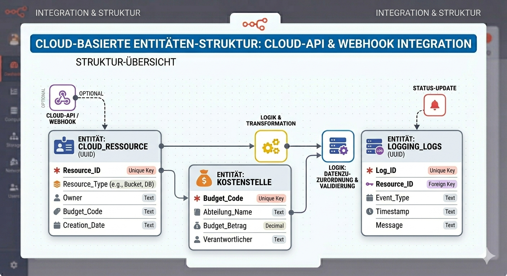
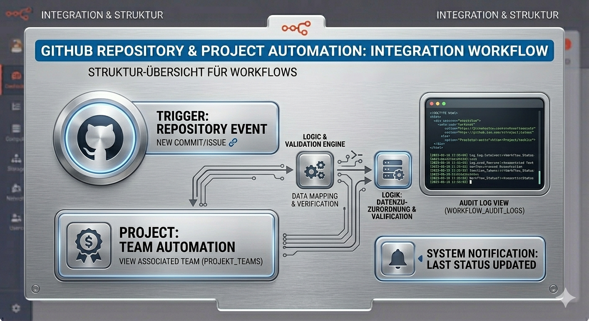
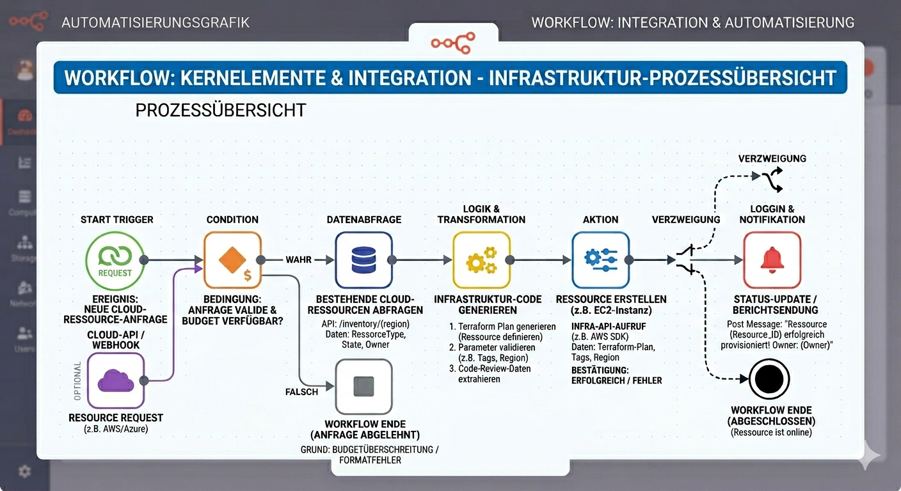

# Projekt-_Beate-Pr-ssel_AIA_AI_-_Automation_Club_Webseite
## Projekt AIA Webseite mit AI &amp; Opencode

README.md
Projektübersicht:

Die AIA – AI & Automation Club Webseite ist eine moderne, statische Webpräsenz. Sie präsentiert Ziele, Projekte und Kontaktmöglichkeiten. 

Das Projekt wurde mit HTML, CSS und JavaScript umgesetzt und über GitHub Pages veröffentlicht.
Der Fokus liegt auf einer klaren Struktur, guter Lesbarkeit und responsivem Design.

Live-Demo
Veröffentlichte Webseite:  
https://bea963.github.io/Projekt-Beate-Pruessel_AIA_AI-_Automation_Club_Webseite/

GitHub‑Repository:  
https://github.com/Bea963/Projekt-Beate-Pruessel_AIA_AI-_Automation_Club_Webseite

## Features
Responsives Layout für Desktop, Tablet und Smartphone

Mehrseitige Struktur (Startseite, Über uns, Kontakt usw.)

Klare Navigationsstruktur

Saubere Trennung von HTML, CSS und JavaScript

Hosting über GitHub Pages

Übersichtliche Projektstruktur

## Technologien
- HTML5
- CSS3
- JavaScript
- GitHub Pages


## Projektstruktur:
```plaintext
/
├── index.html
├── about.html
├── contact.html
├── styles/
│   └── style.css
├── scripts/
│   └── main.js
└── assets/
    ├── images/
    └── icons/

```

## Roadmap
Erweiterung um eine Blog‑ oder News‑Sektion

Integration eines funktionalen Kontaktformulars

Mehrsprachige Version (DE/EN)

Verbesserungen im Bereich Barrierefreiheit

Beitrag leisten
Beiträge sind willkommen.
Änderungen können über Pull Requests oder Issues eingereicht werden.

## Lizenz

## License

Copyright (c) 2026 Beate Prüssel  
All rights reserved.

Downloading, running, and sharing this project is permitted,  
**as long as the original author is credited or the official project website is linked:**

https://bea963.github.io/Projekt-_Beate-Pruessel_AIA_AI_-_Automation_Club_Webseite/

The following actions are not permitted:

- redistributing the project under your own name or as your own work  
- publishing modified or unmodified versions without proper attribution  
- commercial use without prior written permission  
- removing or altering copyright notices  

### Protection of Third‑Party Content
Graphics, icons, fonts, music, code, or other media included in this project  
are subject to the licenses of their respective original authors.

Third‑party components remain under their original licenses.  
Their use is permitted only under the terms defined by their creators.

### Exceptions
Any use beyond the permissions stated above requires prior written consent  
from the rights holder.


## Lizenz

Copyright (c) 2026 Beate Prüssel  
Alle Rechte vorbehalten.

Das Herunterladen, lokale Ausführen und Weitergeben dieses Projekts ist erlaubt,  
sofern die ursprüngliche Urheberin genannt oder die offizielle Projektwebseite verlinkt wird:

https://bea963.github.io/Projekt-_Beate-Pruessel_AIA_AI_-_Automation_Club_Webseite/

Nicht gestattet sind:

- die Weiterverbreitung unter eigenem Namen oder als eigenes Werk  
- die Veröffentlichung veränderter oder unveränderter Versionen ohne Quellenangabe  
- die kommerzielle Nutzung ohne ausdrückliche schriftliche Genehmigung  
- das Entfernen oder Verändern von Urheberrechtshinweisen  

### Schutz von Drittanbieter‑Inhalten
In diesem Projekt enthaltene Grafiken, Icons, Schriftarten, Musikstücke, Code oder andere Medien unterliegen den jeweiligen Lizenzen ihrer ursprünglichen Autoren. 

Komponenten von Drittanbietern unterliegen weiterhin ihren jeweiligen Lizenzen. Ihre Nutzung ist ausschließlich unter den Bedingungen der ursprünglichen Autoren gestattet.

### Ausnahmen
Eine weitergehende Nutzung ist nur nach vorheriger schriftlicher Zustimmung der Rechteinhaberin gestattet.

## Kontakt:
Beate Prüssel  
GitHub: https://github.com/Bea963


## Visuelle Elemente

### Diagramme



